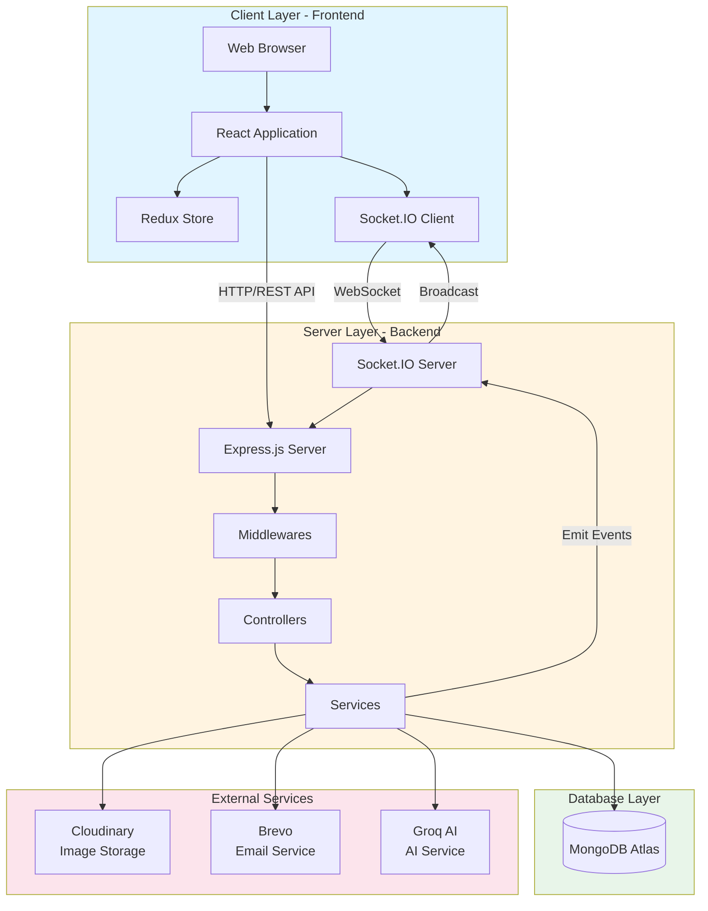
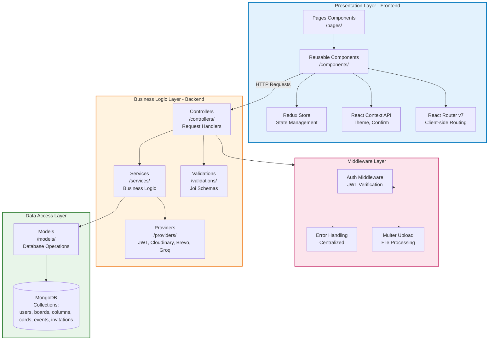
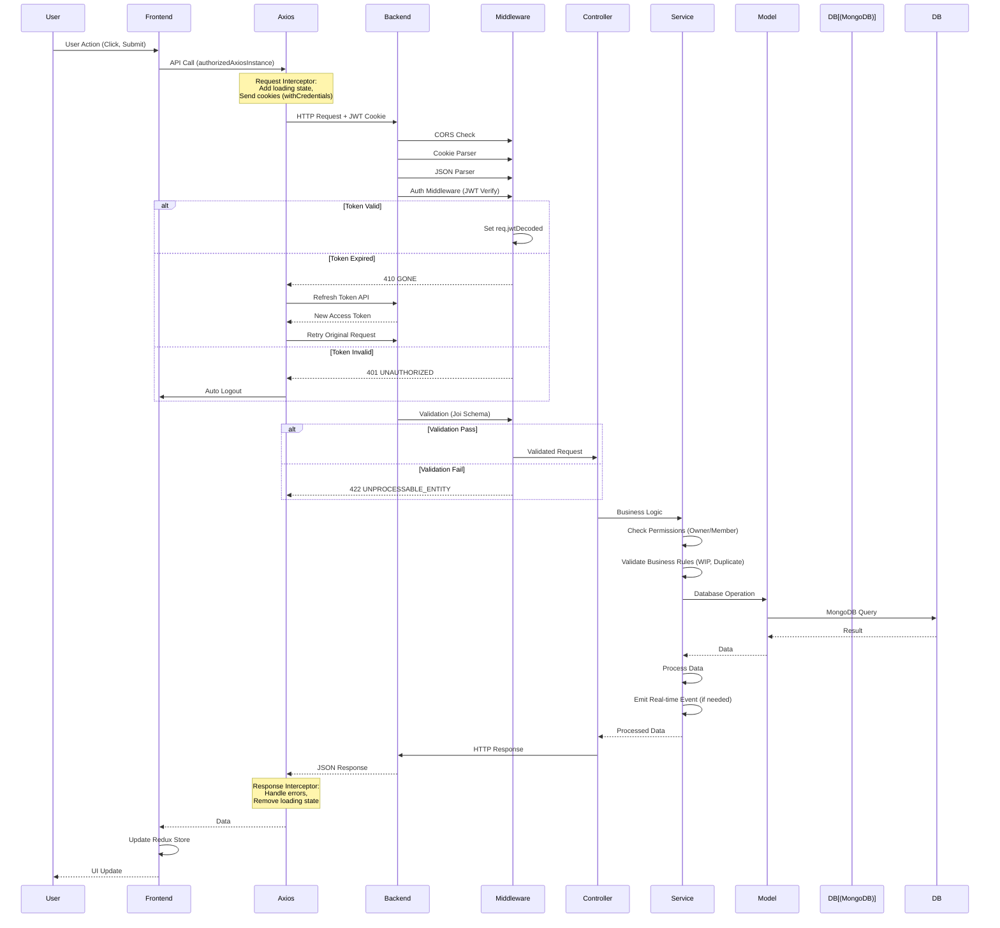
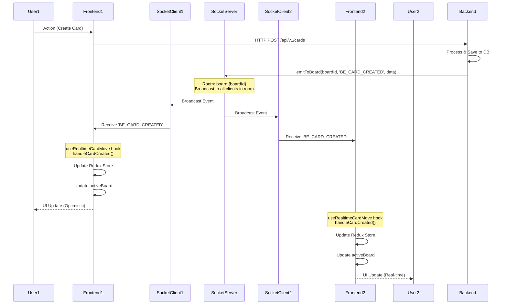
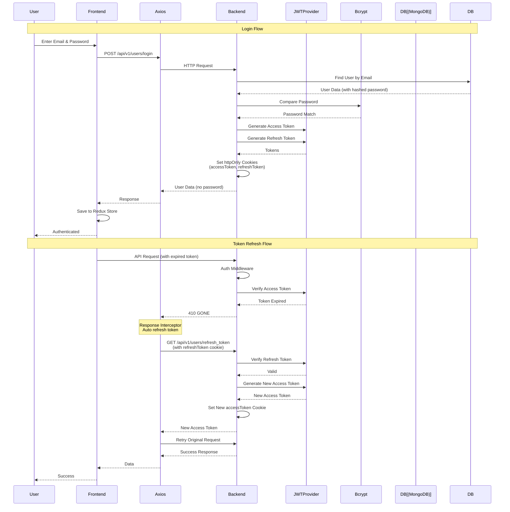
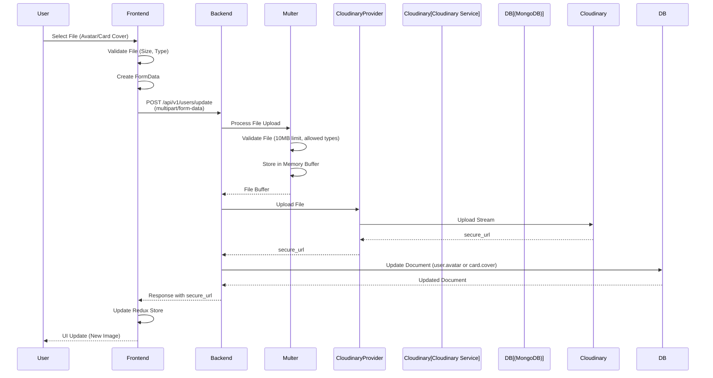

## Sơ đồ Kiến trúc Tổng thể

Các sơ đồ mô tả kiến trúc hệ thống quản lý công việc theo mô hình Kanban.

### 1. Sơ đồ Kiến trúc Hệ thống (System Architecture Diagram)

**Mô tả:**
- **Client Layer**: React application chạy trên browser, quản lý state với Redux, giao tiếp real-time qua Socket.IO client
- **Server Layer**: Express.js xử lý HTTP requests, Socket.IO xử lý WebSocket connections, kiến trúc 3 tầng (Controllers → Services → Models)
- **Database Layer**: MongoDB Atlas lưu trữ dữ liệu dạng NoSQL
- **External Services**: Cloudinary (images), Brevo (email), Groq (AI suggestions)

### 2. Mô hình Phân lớp (Layered Architecture Diagram)

**Mô tả các tầng:**
- **Presentation Layer**: React components, Redux state management, React Context, React Router
- **Business Logic Layer**: Controllers xử lý requests, Services chứa business logic, Validations và Providers
- **Data Access Layer**: Models thao tác với MongoDB collections
- **Middleware Layer**: Xử lý authentication, errors, file uploads

### 3. Sơ đồ Luồng Dữ liệu - HTTP Request (Data Flow Diagram)

### 4. Sơ đồ Luồng Dữ liệu - Real-time Updates (Socket.IO)

### 5. Sơ đồ Luồng Dữ liệu - Authentication Flow

### 6. Sơ đồ Luồng Dữ liệu - File Upload Flow

---

**Ghi chú:**
- Tất cả các sơ đồ được tạo dựa trên kiến trúc thực tế của hệ thống
- Các luồng dữ liệu mô tả chính xác cách hệ thống xử lý requests và real-time updates
- Sơ đồ có thể được sử dụng trực tiếp trong báo cáo hoặc chuyển đổi sang định dạng khác nếu cần

