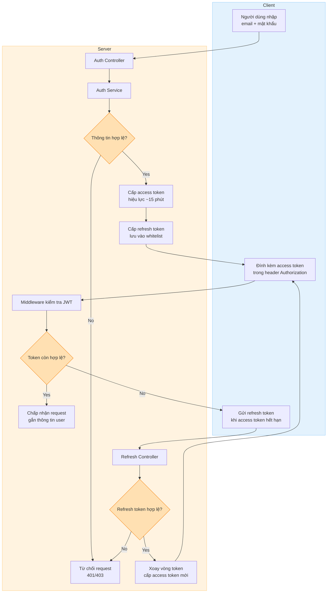

## Authentication Flow Diagram

Sơ đồ mô tả vòng đời xác thực người dùng với JWT, refresh token và middleware bảo vệ API.

```mermaid
flowchart TB
    subgraph Client
        A[Người dùng nhập<br/>email + mật khẩu]
        B[Đính kèm access token<br/>trong header Authorization]
        C[Gửi refresh token<br/>khi access token hết hạn]
    end

    subgraph Server
        D[Auth Controller]
        E[Auth Service]
        F{Thông tin hợp lệ?}
        G[Cấp access token<br/>hiệu lực ~15 phút]
        H[Cấp refresh token<br/>lưu vào whitelist]
        I[Middleware kiểm tra JWT]
        J{Token còn hợp lệ?}
        K[Chấp nhận request<br/>gắn thông tin user]
        L[Từ chối request<br/>401/403]
        M[Refresh Controller]
        N{Refresh token hợp lệ?}
        O[Xoay vòng token<br/>cấp access token mới]
    end

    A --> D --> E --> F
    F -- Yes --> G --> H --> B
    F -- No --> L
    B --> I --> J
    J -- Yes --> K
    J -- No --> C
    C --> M --> N
    N -- Yes --> O --> B
    N -- No --> L

    style Client fill:#e3f2fd,stroke:#90caf9,stroke-width:1px;
    style Server fill:#fff3e0,stroke:#ffcc80,stroke-width:1px;
    classDef decision fill:#ffe0b2,stroke:#f57c00,stroke-width:1px;
    class F,J,N decision;
```

