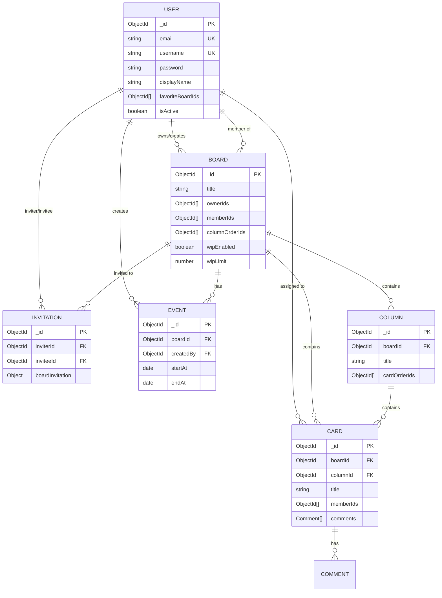
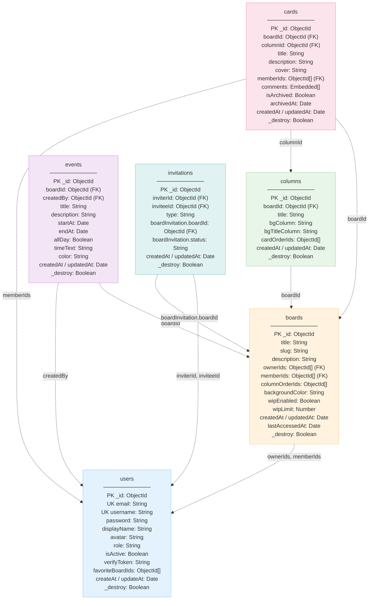
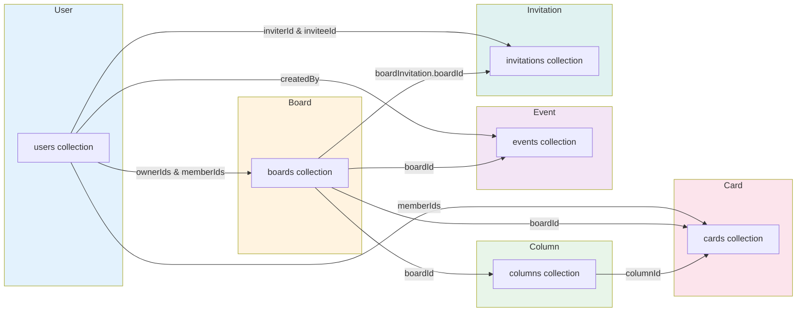

## Sơ đồ Thiết kế Database

Các sơ đồ mô tả thiết kế database của hệ thống quản lý công việc theo mô hình Kanban.

### 1. ER Diagram (Entity Relationship Diagram)

Sơ đồ ER mô tả mối quan hệ giữa các entity chính trong hệ thống.

**Mô tả các mối quan hệ:**
- **USER ↔ BOARD**: Quan hệ nhiều-nhiều qua `ownerIds[]` và `memberIds[]`
- **BOARD ↔ COLUMN**: Quan hệ một-nhiều qua `boardId`
- **BOARD ↔ CARD**: Quan hệ một-nhiều qua `boardId`
- **COLUMN ↔ CARD**: Quan hệ một-nhiều qua `columnId`
- **USER ↔ CARD**: Quan hệ nhiều-nhiều qua `memberIds[]`
- **CARD ↔ COMMENT**: Quan hệ một-nhiều embedded qua `comments[]`
- **BOARD ↔ EVENT**: Quan hệ một-nhiều qua `boardId`
- **USER ↔ EVENT**: Quan hệ một-nhiều qua `createdBy`
- **USER ↔ INVITATION**: Quan hệ một-nhiều qua `inviterId` và `inviteeId`
- **BOARD ↔ INVITATION**: Quan hệ một-nhiều qua `boardInvitation.boardId`

### 2. Database Schema Diagram

Sơ đồ schema chi tiết các collection và các trường dữ liệu chính.

**Mô tả các collection:**
- **users**: Quản lý thông tin người dùng, xác thực, danh sách board yêu thích
- **boards**: Quản lý board, thành viên (owner/member), cấu hình WIP, thứ tự columns
- **columns**: Quản lý columns trong board, thứ tự cards
- **cards**: Quản lý cards, thành viên được gán, comments (embedded)
- **events**: Quản lý sự kiện liên kết với board, hiển thị trên lịch
- **invitations**: Quản lý lời mời tham gia board

### 3. Mối quan hệ giữa các Collection (Relationship Diagram)

Sơ đồ mô tả chi tiết các mối quan hệ giữa các collection.

**Loại quan hệ:**
- **Referenced Relationships**: Quan hệ tham chiếu qua ObjectId (USER ↔ BOARD, BOARD ↔ COLUMN, BOARD ↔ CARD, COLUMN ↔ CARD, USER ↔ CARD, BOARD ↔ EVENT, USER ↔ EVENT, USER ↔ INVITATION, BOARD ↔ INVITATION)
- **Embedded Relationships**: Quan hệ nhúng (CARD ↔ COMMENT - comments được nhúng trong document card)
- **Order Management**: Quản lý thứ tự qua mảng `orderIds` (`boards.columnOrderIds[]`, `columns.cardOrderIds[]`)

### 4. Bảng tổng hợp mối quan hệ

| Collection A | Quan hệ | Collection B | Loại quan hệ | Cách thực hiện |
|--------------|---------|--------------|--------------|----------------|
| users | ↔ | boards | Nhiều-nhiều | `boards.ownerIds[]`, `boards.memberIds[]` |
| boards | → | columns | Một-nhiều | `columns.boardId` |
| boards | → | cards | Một-nhiều | `cards.boardId` |
| columns | → | cards | Một-nhiều | `cards.columnId` |
| users | ↔ | cards | Nhiều-nhiều | `cards.memberIds[]` |
| cards | → | comments | Một-nhiều | `cards.comments[]` (embedded) |
| boards | → | events | Một-nhiều | `events.boardId` |
| users | → | events | Một-nhiều | `events.createdBy` |
| users | → | invitations | Một-nhiều | `invitations.inviterId`, `invitations.inviteeId` |
| boards | → | invitations | Một-nhiều | `invitations.boardInvitation.boardId` |

**Ghi chú:**
- PK: Primary Key
- FK: Foreign Key
- UK: Unique Key
- Embedded: Dữ liệu được nhúng trực tiếp trong document
- Array: Mảng ObjectId để quản lý quan hệ nhiều-nhiều hoặc thứ tự

