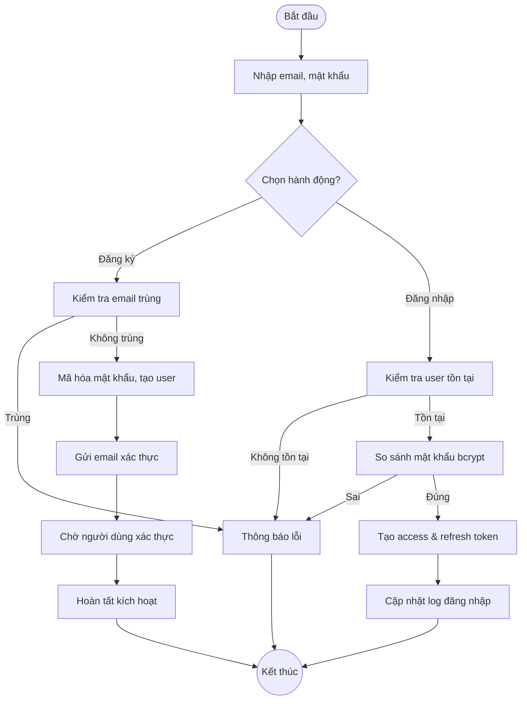
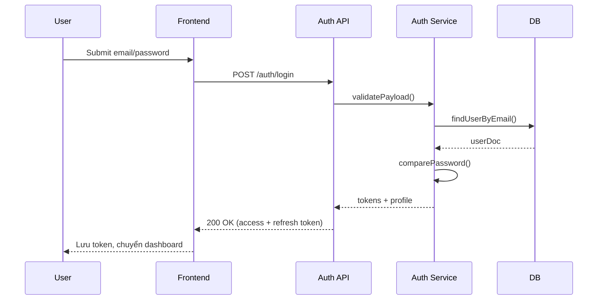
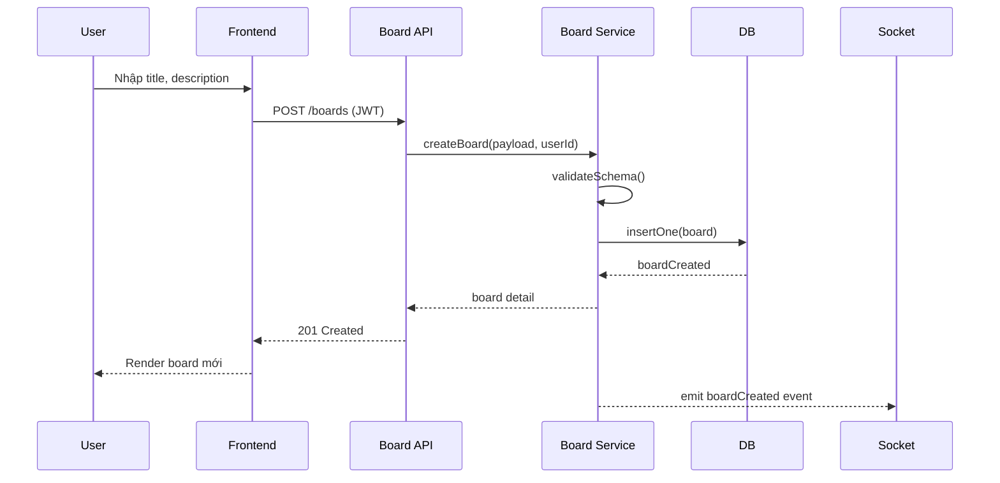
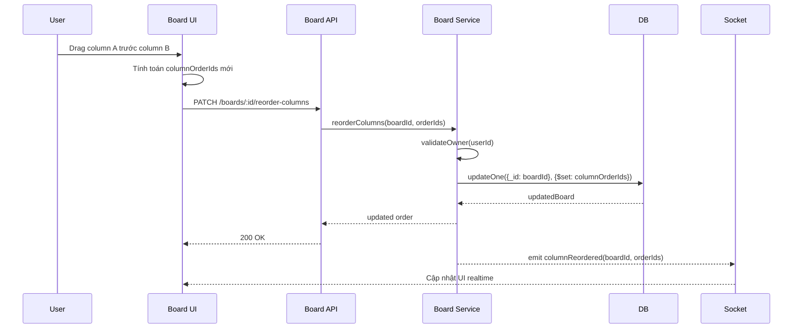
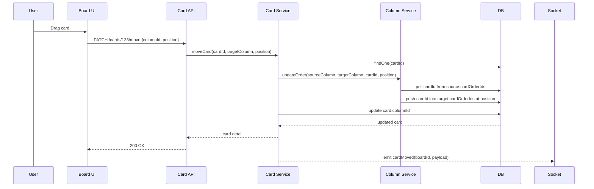
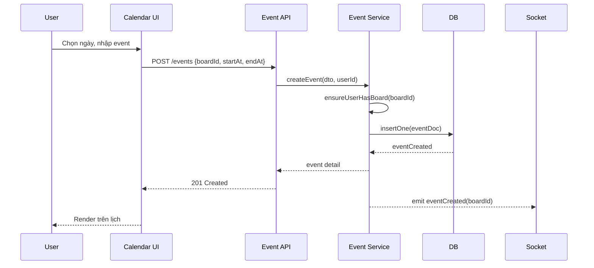
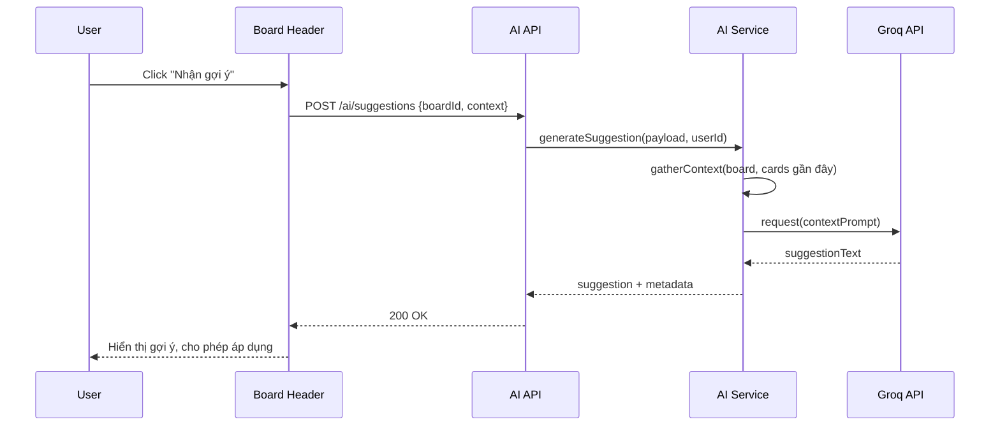
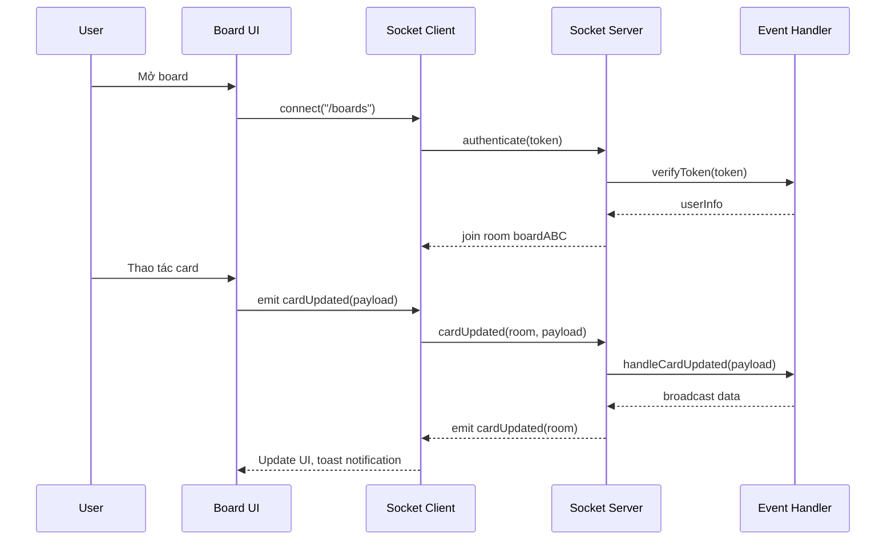

## Thiết kế Các Module Chính

Tài liệu này tập hợp các Activity Diagram và Sequence Diagram cho các module quan trọng của hệ thống.

---

### 1. Module Authentication

**Activity Diagram – Quy trình đăng ký/đăng nhập**



**Sequence Diagram – Authentication Flow**



---

### 2. Module Quản lý Board

**Activity Diagram – Quy trình quản lý board**

```mermaid
flowchart TB
    A([Bắt đầu]) --> B[Owner mở trang Boards]
    B --> C[Chọn hành động]
    C -->|Tạo board| D[Nhập thông tin + màu nền]
    D --> E[Validate title/slug]
    E -->|Hợp lệ| F[Tạo board, set ownerIds]
    E -->|Không hợp lệ| G[Hiển thị lỗi]
    C -->|Chỉnh sửa| H[Kiểm tra quyền Owner]
    H -->|Đúng| I[Cập nhật metadata, WIP, colors]
    H -->|Sai| G
    C -->|Xóa| J[Xác nhận + kiểm tra quyền]
    J -->|Đúng| K[Xóa mềm board, cascade column/card]
    C -->|Mời thành viên| L[Nhập email invitee]
    L --> M[Tạo invitation + gửi email]
    C -->|Đánh dấu yêu thích| N[Toggle favoriteBoardIds]
    {F,I,K,M,N} --> O[Cập nhật realtime + log]
    {G,O} --> P((Kết thúc))
```

**Sequence Diagram – Tạo board**



---

### 3. Module Quản lý Column

**Activity Diagram – CRUD Column & Drag/Drop**

```mermaid
flowchart TB
    A([Bắt đầu]) --> B[Owner mở board]
    B --> C{Hành động?}
    C -->|Tạo column| D[Nhập title, màu]
    D --> E[Validate + convert ObjectId]
    E --> F[Insert column]
    F --> G[Push columnId vào columnOrderIds]
    C -->|Sửa column| H[Kiểm tra quyền Owner]
    H -->|OK| I[Cập nhật title/màu]
    C -->|Xóa column| J[Xác nhận]
    J --> K[Xóa column + cards thuộc column]
    C -->|Sắp xếp| L[Drag & Drop column]
    L --> M[Gửi mảng columnOrderIds mới]
    M --> N[Cập nhật board.columnOrderIds]
    {G,I,K,N} --> O[Emit realtime update]
    O --> P((Kết thúc))
```

**Sequence Diagram – Drag & Drop Column**



---

### 4. Module Quản lý Card

**Activity Diagram – Vòng đời Card**

```mermaid
flowchart TB
    A([Bắt đầu]) --> B[Owner/Member mở board]
    B --> C{Hành động?}
    C -->|Tạo card| D[Nhập title, column đích]
    D --> E[Validate + insert card]
    E --> F[Update column.cardOrderIds]
    C -->|Cập nhật card| G[Chỉnh sửa mô tả, cover, members]
    G --> H[Validate markdown, xử lý upload]
    H --> I[Update card + broadcast]
    C -->|Di chuyển card| J[Drag card sang column khác]
    J --> K[Update card.columnId]
    K --> L[Update order của hai column]
    C -->|Bình luận| M[Nhập comment]
    M --> N[Push comment embedded]
    C -->|Lưu trữ| O[Set isArchived=true]
    C -->|Khôi phục| P[Set isArchived=false]
    {F,I,L,N,O,P} --> Q[Emit socket event + ghi lịch sử]
    Q --> R((Kết thúc))
```

**Sequence Diagram – Di chuyển Card**



---

### 5. Module Calendar

**Activity Diagram – Quản lý sự kiện**

```mermaid
flowchart TB
    A([Bắt đầu]) --> B[Người dùng chọn tab Lịch]
    B --> C[Tải sự kiện theo board quyền truy cập]
    C --> D{Hành động?}
    D -->|Tạo| E[Mở modal tạo sự kiện]
    E --> F[Nhập title, thời gian, liên kết board]
    F --> G[Validate xung đột thời gian]
    G -->|OK| H[Lưu event vào DB]
    D -->|Sửa| I[Chọn event, mở modal]
    I --> J[Cập nhật trường]
    J --> H
    D -->|Xóa| K[Xác nhận xóa]
    K --> L[Xóa mềm event]
    {H,L} --> M[Reload calendar + thông báo]
    M --> N((Kết thúc))
```

**Sequence Diagram – Tạo sự kiện**



---

### 6. Module AI Suggestions

**Sequence Diagram – AI Suggestion Flow**



**Flowchart – Quy trình tạo gợi ý**

```mermaid
flowchart TB
    A([Bắt đầu]) --> B[Lấy boardId, card context]
    B --> C[Chuẩn hóa dữ liệu (markdown -> text)]
    C --> D[Xây dựng prompt]
    D --> E[Gọi Groq API]
    E --> F{Thành công?}
    F -->|Không| G[Retry/Thông báo lỗi]
    F -->|Có| H[Hậu xử lý kết quả (split bước)]
    H --> I[Lưu cache ngắn hạn]
    {G,I} --> J[Trả response cho client]
    J --> K((Kết thúc))
```

---

### 7. Module Real-time Updates

**Sequence Diagram – Socket.IO Communication**



**Activity Diagram – Socket Event Handling**

```mermaid
flowchart TB
    A([Client connect]) --> B[Xác thực token]
    B -->|Hợp lệ| C[Gia nhập room board]
    B -->|Không| D[Từ chối kết nối]
    C --> E{Nhận sự kiện?}
    E -->|cardUpdated| F[Kiểm tra quyền user]
    F -->|OK| G[Update DB + emit đến room]
    F -->|Fail| H[Emit lỗi riêng client]
    E -->|columnMoved| I[Update order + emit]
    E -->|memberPresence| J[Ghi trạng thái online]
    {G,I,J,H} --> E
    D --> K((Kết thúc))
```

