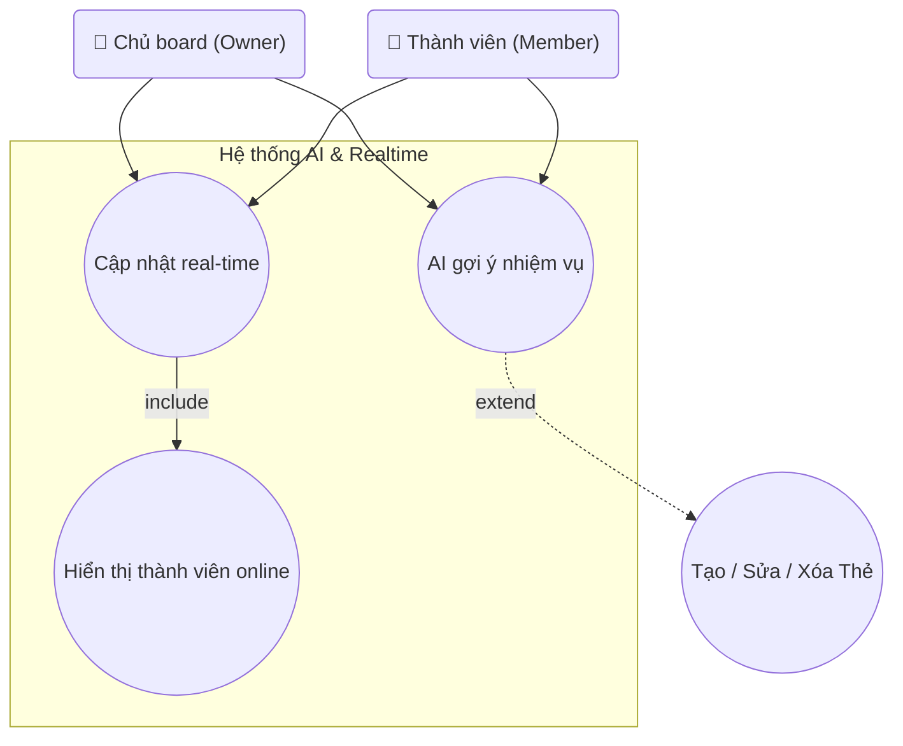

## Biểu đồ Use Case: AI & Realtime

Sơ đồ chi tiết các use case liên quan đến AI gợi ý và cập nhật real-time.

**Mô tả các Use Case:**

- **UC_AISuggest (AI gợi ý nhiệm vụ)**: 
  - Khi người dùng tạo thẻ mới, hệ thống sử dụng AI (Groq SDK) để phân tích nội dung và gợi ý các nhiệm vụ liên quan
  - Gợi ý được hiển thị trong component `TaskSuggestions`
  - Người dùng có thể chấp nhận hoặc bỏ qua gợi ý
  - Hỗ trợ cả Owner và Member
  - Quan hệ **extend** với UC_ManageCards: AI gợi ý là tùy chọn, chỉ xuất hiện khi người dùng tạo thẻ mới

- **UC_Realtime (Cập nhật real-time)**: 
  - Tất cả thay đổi trên board (cột, thẻ, thành viên, board settings) đều được cập nhật real-time qua Socket.IO
  - Các sự kiện real-time bao gồm:
    - `BE_COLUMNS_REORDERED`: Sắp xếp lại cột
    - `BE_COLUMN_CREATED/UPDATED/DELETED`: Thay đổi cột
    - `BE_CARD_MOVED_IN_COLUMN/BETWEEN_COLUMNS`: Di chuyển thẻ
    - `BE_CARD_CREATED/UPDATED/DELETED`: Thay đổi thẻ
    - `BE_BOARD_UPDATED/DELETED`: Thay đổi board
    - `BE_MEMBER_LEFT_BOARD`: Thành viên rời board
    - `BE_USER_INVITED_TO_BOARD`: Mời thành viên mới
  - Hỗ trợ cả Owner và Member
  - Quan hệ **include** với UC_OnlineUsers: Khi có cập nhật real-time, hệ thống cũng cập nhật danh sách thành viên online

- **UC_OnlineUsers (Hiển thị thành viên online)**: 
  - Hiển thị danh sách thành viên đang online trên board
  - Cập nhật real-time khi có thành viên join/leave board
  - Sử dụng hook `useBoardOnlineUsers` để quản lý trạng thái
  - Quan hệ **include** với UC_Realtime: Luôn được cập nhật cùng với các sự kiện real-time khác

**Actors:**
- **Chủ board (Owner)**: Có quyền sử dụng AI gợi ý và nhận cập nhật real-time.
- **Thành viên (Member)**: Có quyền sử dụng AI gợi ý và nhận cập nhật real-time.

**Ghi chú:**
- `UC_ManageCards` được tham chiếu trong sơ đồ để thể hiện quan hệ extend với `UC_AISuggest`, nhưng nó thuộc nhóm "Cột & Thẻ" và được mô tả chi tiết trong sơ đồ tương ứng.

