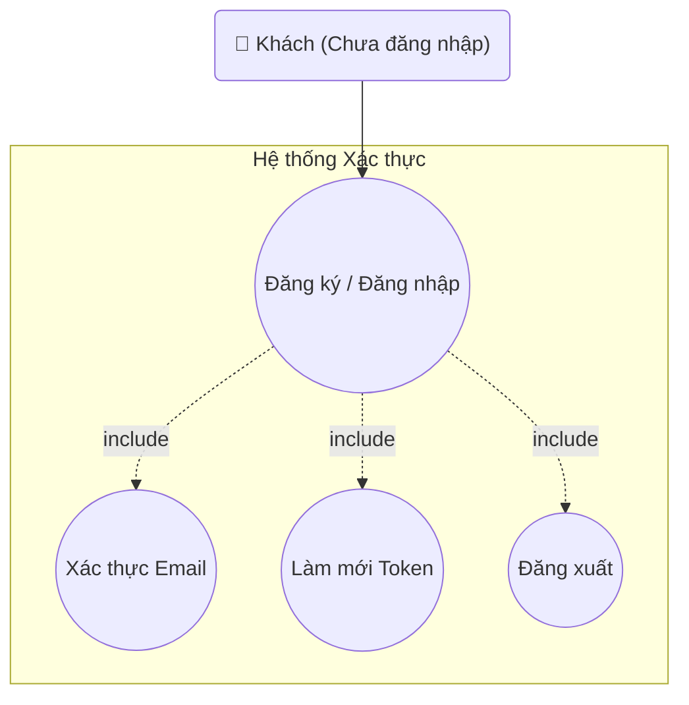

## Biểu đồ Use Case: Xác thực người dùng

Sơ đồ chi tiết các use case liên quan đến xác thực và quản lý phiên đăng nhập.

**Mô tả các Use Case:**

- **UC_Auth (Đăng ký / Đăng nhập)**: Use case chính cho việc đăng ký tài khoản mới hoặc đăng nhập vào hệ thống. Bao gồm xác thực thông tin đăng nhập và tạo phiên làm việc.

- **UC_Verify (Xác thực Email)**: Xác thực địa chỉ email sau khi đăng ký. Người dùng nhận email xác thực và click link để kích hoạt tài khoản. Quan hệ **include** với UC_Auth.

- **UC_Refresh (Làm mới Token)**: Tự động làm mới JWT token khi token hiện tại sắp hết hạn, đảm bảo phiên làm việc không bị gián đoạn. Quan hệ **include** với UC_Auth.

- **UC_SignOut (Đăng xuất)**: Kết thúc phiên làm việc, xóa token và chuyển người dùng về trạng thái chưa đăng nhập. Quan hệ **include** với UC_Auth.

**Actor:**
- **Khách (Chưa đăng nhập)**: Người dùng chưa có tài khoản hoặc chưa đăng nhập vào hệ thống.

