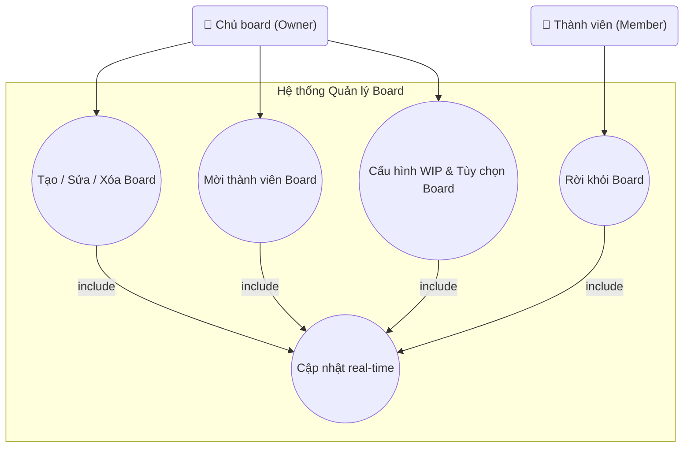

## Biểu đồ Use Case: Quản lý Board

Sơ đồ chi tiết các use case liên quan đến quản lý board (tạo, sửa, xóa, mời thành viên, cấu hình).

**Mô tả các Use Case:**

- **UC_CreateBoard (Tạo / Sửa / Xóa Board)**: Tạo board mới, chỉnh sửa thông tin board (tiêu đề, mô tả, màu nền), hoặc xóa board. Chỉ Owner mới có quyền thực hiện các thao tác này. Quan hệ **include** với UC_Realtime để cập nhật real-time cho tất cả thành viên.

- **UC_Invite (Mời thành viên Board)**: Mời người dùng khác tham gia board thông qua email. Chỉ Owner mới có quyền mời thành viên. Quan hệ **include** với UC_Realtime để thông báo real-time cho thành viên mới.

- **UC_BoardWIP (Cấu hình WIP & Tùy chọn Board)**: Cấu hình giới hạn WIP (Work In Progress) cho các cột và các tùy chọn khác của board như màu sắc, mô tả. Có UI riêng (modal), logic validation riêng (kiểm tra số lượng card), và mục đích nghiệp vụ riêng. Chỉ Owner mới được phép cấu hình. Quan hệ **include** với UC_Realtime.

- **UC_LeaveBoard (Rời khỏi Board)**: Thành viên có thể tự rời khỏi board mà họ không phải là Owner. Quan hệ **include** với UC_Realtime để thông báo cho Owner và các thành viên khác.

- **UC_Realtime (Cập nhật real-time)**: Tất cả thao tác quản lý board đều trigger cập nhật real-time qua Socket.IO để đồng bộ với tất cả thành viên đang online.

**Actors:**
- **Chủ board (Owner)**: Có quyền tạo, sửa, xóa board, mời thành viên, và cấu hình WIP.
- **Thành viên (Member)**: Chỉ có quyền rời khỏi board.

