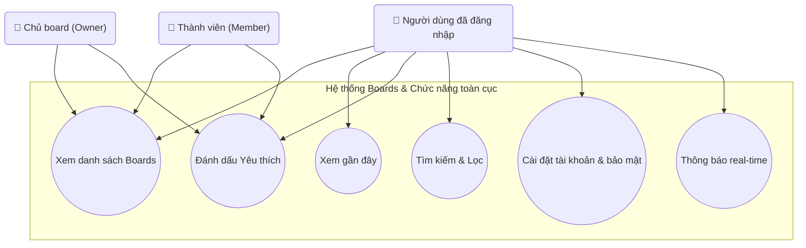

## Biểu đồ Use Case: Boards & Các chức năng toàn cục

Sơ đồ chi tiết các use case liên quan đến quản lý danh sách boards và các chức năng toàn cục của hệ thống.

**Mô tả các Use Case:**

- **UC_ViewBoards (Xem danh sách Boards)**: Xem danh sách tất cả boards mà người dùng có quyền truy cập, bao gồm boards do người dùng tạo và boards được mời tham gia.

- **UC_Recent (Xem gần đây)**: Xem danh sách các boards đã truy cập gần đây, giúp người dùng nhanh chóng quay lại công việc đang làm.

- **UC_Starred (Đánh dấu Yêu thích)**: Đánh dấu hoặc bỏ đánh dấu board yêu thích. Mỗi người dùng có danh sách boards yêu thích riêng, không ảnh hưởng đến người dùng khác.

- **UC_Search (Tìm kiếm & Lọc)**: Tìm kiếm và lọc boards, cards, events theo từ khóa hoặc tiêu chí. Hỗ trợ tìm kiếm toàn cục trong hệ thống.

- **UC_Settings (Cài đặt tài khoản & bảo mật)**: Quản lý cài đặt tài khoản cá nhân, thông tin profile, mật khẩu, và các tùy chọn bảo mật.

- **UC_Notifications (Thông báo real-time)**: Nhận và xem thông báo real-time về các hoạt động trong boards như thẻ mới, bình luận, mời tham gia, v.v.

**Actors:**
- **Người dùng đã đăng nhập (User)**: Người dùng đã xác thực, có quyền truy cập tất cả chức năng toàn cục.
- **Chủ board (Owner)**: Có thể xem danh sách boards và đánh dấu yêu thích.
- **Thành viên (Member)**: Có thể xem danh sách boards và đánh dấu yêu thích.

