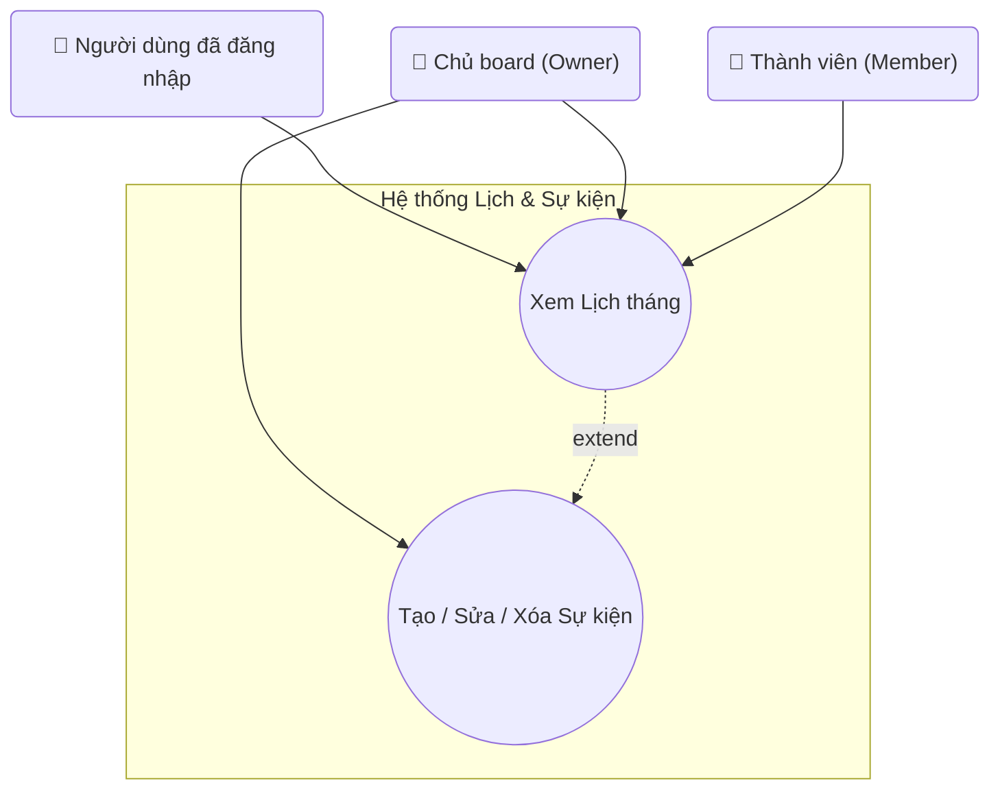

## Biểu đồ Use Case: Lịch & Sự kiện

Sơ đồ chi tiết các use case liên quan đến quản lý lịch và sự kiện.

**Mô tả các Use Case:**

- **UC_Calendar (Xem Lịch tháng)**: Xem lịch tháng với tất cả các sự kiện đã được tạo. Hiển thị sự kiện theo ngày, có thể xem chi tiết sự kiện khi click vào. Tất cả người dùng đã đăng nhập (User, Owner, Member) đều có quyền xem lịch.

- **UC_ManageEvents (Tạo / Sửa / Xóa Sự kiện)**: 
  - Tạo sự kiện mới với thông tin: tiêu đề, mô tả, ngày bắt đầu, ngày kết thúc, thời gian, màu sắc
  - Chỉnh sửa sự kiện đã tạo
  - Xóa sự kiện
  - Đổi màu sự kiện
  - Liên kết sự kiện với board cụ thể
  Chỉ Owner mới có quyền quản lý sự kiện. Member chỉ có thể xem lịch thông qua UC_Calendar.

- **Quan hệ Extend**: `UC_ManageEvents` mở rộng `UC_Calendar` - khi Owner đang xem lịch, họ có thể mở rộng chức năng để tạo, sửa, hoặc xóa sự kiện. Đây là quan hệ **extend** vì quản lý sự kiện là tùy chọn, chỉ áp dụng cho Owner.

**Actors:**
- **Người dùng đã đăng nhập (User)**: Có quyền xem lịch tháng.
- **Chủ board (Owner)**: Có quyền xem lịch và quản lý sự kiện (tạo, sửa, xóa).
- **Thành viên (Member)**: Chỉ có quyền xem lịch, không thể quản lý sự kiện.

