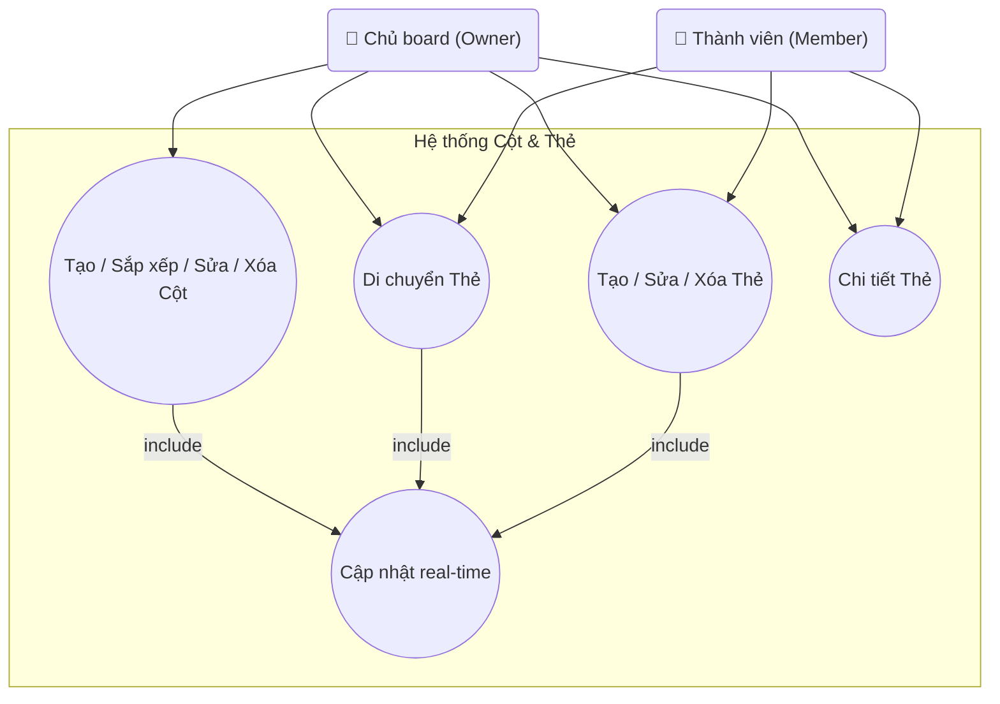

## Biểu đồ Use Case: Cột & Thẻ

Sơ đồ chi tiết các use case liên quan đến quản lý cột và thẻ trên board.

**Mô tả các Use Case:**

- **UC_ManageColumns (Tạo / Sắp xếp / Sửa / Xóa Cột)**: Tạo cột mới, sắp xếp lại thứ tự cột (drag & drop), chỉnh sửa tên cột, hoặc xóa cột. Chỉ Owner mới có quyền quản lý cột. Quan hệ **include** với UC_Realtime để cập nhật real-time.

- **UC_MoveCards (Di chuyển Thẻ)**: Di chuyển thẻ trong cùng một cột (thay đổi vị trí) hoặc di chuyển thẻ giữa các cột khác nhau. Hỗ trợ cả Owner và Member. Có logic validation riêng để kiểm tra giới hạn WIP khi di chuyển. Quan hệ **include** với UC_Realtime.

- **UC_ManageCards (Tạo / Sửa / Xóa Thẻ)**: Tạo thẻ mới, chỉnh sửa thông tin cơ bản của thẻ (tiêu đề, mô tả), hoặc xóa thẻ. Hỗ trợ cả Owner và Member. Quan hệ **include** với UC_Realtime.

- **UC_CardDetails (Chi tiết Thẻ)**: Xem và chỉnh sửa chi tiết đầy đủ của thẻ bao gồm:
  - Nội dung Markdown
  - Ảnh cover
  - Gán thành viên
  - Đặt hạn hoàn thành (due date)
  - Thêm checklist, bình luận
  Hỗ trợ cả Owner và Member. Có thể chỉnh sửa từ modal chi tiết.

- **UC_Realtime (Cập nhật real-time)**: Tất cả thao tác trên cột và thẻ đều trigger cập nhật real-time qua Socket.IO để đồng bộ với tất cả thành viên đang online.

**Actors:**
- **Chủ board (Owner)**: Có quyền quản lý cột và tất cả thao tác với thẻ.
- **Thành viên (Member)**: Có quyền di chuyển thẻ, tạo/sửa/xóa thẻ, và xem chi tiết thẻ, nhưng không thể quản lý cột.

