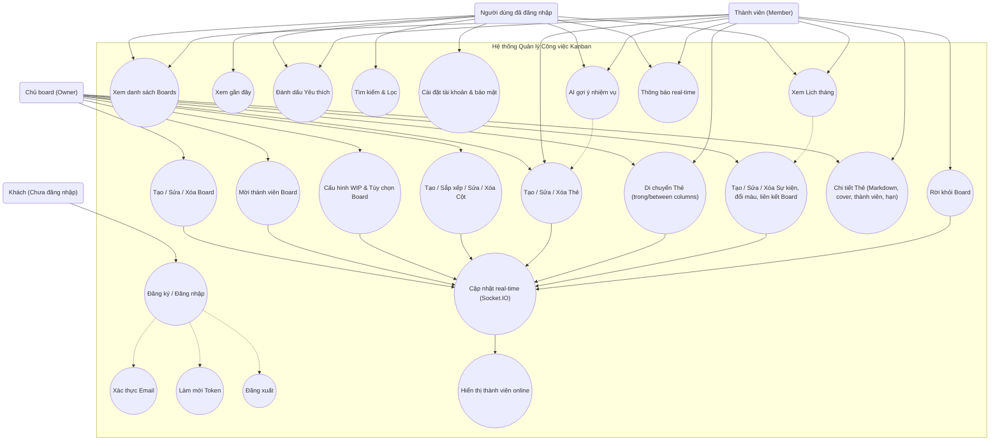

## Biểu đồ Use Case tổng quan

Sơ đồ khái quát tác nhân và các ca sử dụng chính của hệ thống Kanban Todo.

**Ghi chú quyền hạn chính:**
- `UC_ManageEvents` chỉ khả dụng cho `actorOwner`; `actorMember` chỉ truy cập lịch thông qua `UC_Calendar`.
- `UC_MoveCards` hỗ trợ cả Owner và Member, nhưng quản lý cột (`UC_ManageColumns`) chỉ Owner được phép.
- Đánh dấu yêu thích board (`UC_Starred`) được lưu theo từng người dùng, áp dụng cho Owner và Member.
- Sự kiện realtime (`UC_Realtime`) tự động thông báo Owner khi Member rời board, đồng thời cập nhật danh sách người dùng online (`UC_OnlineUsers`).
- `UC_BoardWIP` (Cấu hình WIP) là một use case riêng biệt mặc dù về mặt kỹ thuật sử dụng cùng API cập nhật board. Nó có UI riêng (modal), logic validation riêng (kiểm tra số lượng card), và mục đích nghiệp vụ riêng (quản lý giới hạn công việc). Chỉ Owner mới được phép cấu hình WIP.

Gợi ý chèn vào báo cáo: nhúng file hoặc copy đoạn code Mermaid vào công cụ hỗ trợ Mermaid; có thể chuyển sang PlantUML nếu cần.

